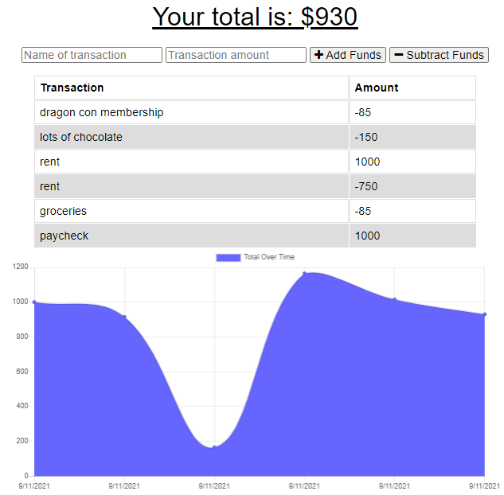
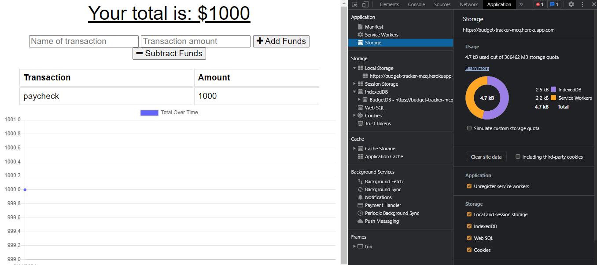
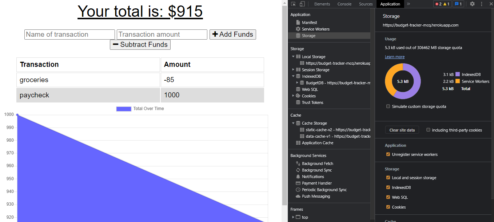
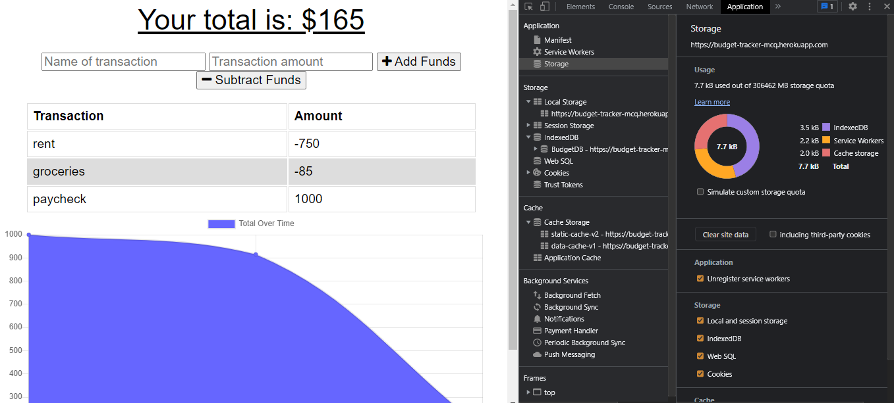
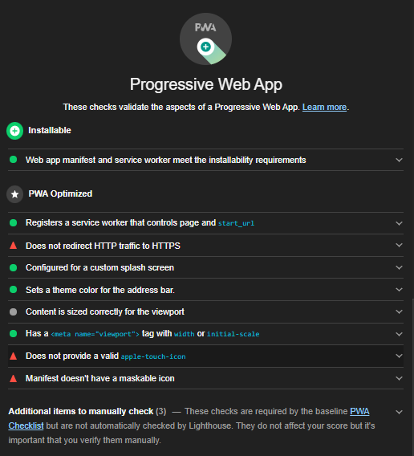

# PWA-Budget-Trackers

## Licensing:

## Description
Updated Budget Tracker application to allow for offline access and functionality. The user will be able to add expenses and deposits to their budget with or without a connection.
## Table of Contents
* [Installation](#Installation)
* [Usage](#Usage)
* [Technologies](#Technologies)
* [Contributors](#Contributors)
* [Contact](#Contact)
## Installation
Fork this repo and download the files to your local environment. 

1. Run 'npm install'.
2. Start the application's server with the command 'npm start'.
3. App will run on localhost. Deploy to heroku for live site.
## Usage

### Deployed App
https://budget-tracker-mcq.herokuapp.com/
#### _demo_

#### _online_

#### _offline_

#### _back online_

#### _PWA installable_

## Technologies
* JavaScript
* Express
* MongoDB Atlas
* Mongoose
## Contributors
To contribute, please email me at the address below.
## Contact 
https://github.com/shelleymcq or shelleymcq.dev@gmail.com